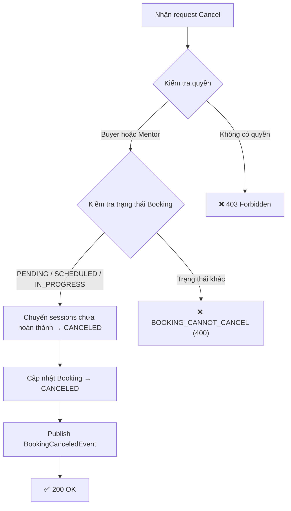
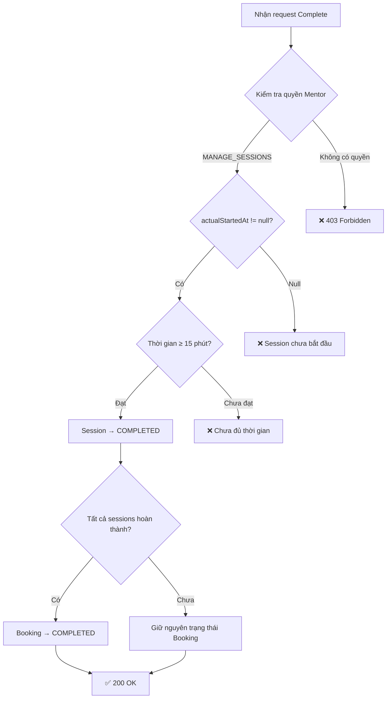

# Tài liệu Triển khai P1 — Hoàn thiện MVP Backend

> **Trạng thái**: ✅ Hoàn thành  
> **Ngày cập nhật**: 2026-05-25  
> **Mục tiêu**: Bổ sung các tính năng còn thiếu để hoàn thiện MVP: quản lý phiên bản gói dịch vụ, mở public read cho buyer, và quản lý vòng đời booking.

---

## Tổng quan

| # | Hạng mục | Trạng thái | Độ phức tạp | Mô tả |
|---|----------|:----------:|:-----------:|--------|
| 6 | Service package version CRUD | ✅ | Thấp | Update, delete, set default version |
| 7 | Public version/curriculum read | ✅ | Rất thấp | Bỏ `MENTOR-only` cho buyer xem được |
| 8 | Booking cancel & complete session | ✅ | Trung bình | Hủy booking + hoàn thành buổi học |

> [!NOTE]
> Các hạng mục **Mentor Availability Slots** và **Reschedule Request Flow** ban đầu thuộc P1 nhưng đã được chuyển sang **P2** do phức tạp (cần entity/table mới + approval flow). Xem chi tiết tại [P2_TECHNICAL_HANDOVER.md](file:///d:/Projects/Sociedu/sociedu-api/P2_TECHNICAL_HANDOVER.md).

---

## 1. Hạng mục #7 — Public Package Version / Curriculum Read

### Mô tả
Cho phép khách (không cần đăng nhập) xem danh sách phiên bản gói dịch vụ và curriculum của các gói đang hoạt động (`isActive = true` và `deletedAt IS NULL`).

### Danh sách API

| Method | Path | Auth | Mô tả |
|--------|------|:----:|--------|
| `GET` | `/api/v1/service-packages/{id}/versions` | 🌐 Public | Danh sách phiên bản gói dịch vụ |
| `GET` | `/api/v1/service-packages/{id}/versions/{versionId}` | 🌐 Public | Chi tiết phiên bản |
| `GET` | `/api/v1/service-packages/{id}/versions/{versionId}/curriculums` | 🌐 Public | Danh sách curriculum của phiên bản |

### Thay đổi kỹ thuật
- Bỏ `@PreAuthorize("hasRole('MENTOR')")` trên 3 endpoint hiện có trong `ServicePackageController`
- Thêm 3 public read methods vào `CatalogService` (không check mentorId ownership)
- Chỉ trả về version/curriculum của package **active + not deleted**
- Mentor vẫn dùng endpoint riêng qua `MentorCatalogController` (`/mentors/me/packages/...`)

---

## 2. Hạng mục #6 — Service Package Version Management

### Mô tả
Cho phép Mentor quản lý (cập nhật, xóa, thiết lập mặc định) các phiên bản gói dịch vụ của mình.

### Danh sách API

| Method | Path | Auth | Mô tả |
|--------|------|:----:|--------|
| `PUT` | `/api/v1/service-packages/{id}/versions/{versionId}` | 🔒 MENTOR | Cập nhật phiên bản (partial update) |
| `PATCH` | `/api/v1/service-packages/{id}/versions/{versionId}/default` | 🔒 MENTOR | Đặt phiên bản làm mặc định |
| `DELETE` | `/api/v1/service-packages/{id}/versions/{versionId}` | 🔒 MENTOR | Xóa phiên bản |

### Request — Cập nhật phiên bản (`PUT`)
Cho phép **partial update**: field nào `null` thì giữ nguyên.

```json
{
  "price": 500000.00,
  "duration": 60,
  "deliveryType": "ONLINE"
}
```

> Giá trị `deliveryType` hợp lệ: `ONLINE`, `OFFLINE`, `HYBRID`.

### Quy tắc nghiệp vụ — Xóa phiên bản (`DELETE`)

| Quy tắc | Mô tả | Mã lỗi |
|----------|--------|--------|
| Có đơn hàng tham chiếu | Không cho xóa version đang có order (dựa trên `orders.service_id`) | `VERSION_HAS_ACTIVE_ORDERS` (409) |
| Là phiên bản mặc định | Phải đặt phiên bản khác làm mặc định trước khi xóa | `CANNOT_DELETE_DEFAULT_VERSION` (409) |
| Là phiên bản duy nhất | Gói dịch vụ phải luôn có ít nhất 1 phiên bản | `PACKAGE_MUST_HAVE_VERSION` (400) |

### Quy tắc nghiệp vụ — Đặt mặc định (`PATCH`)
- Tự động gỡ `isDefault = false` trên **tất cả** phiên bản khác cùng gói
- Đặt `isDefault = true` cho phiên bản được chỉ định

### Database Migration
**File**: `V202605230002__add_service_package_version_fields.sql`

| Cột mới | Kiểu | Mô tả |
|---------|------|--------|
| `version` | `BIGINT NOT NULL DEFAULT 0` | Optimistic Locking (`@Version` JPA) |
| `deleted_at` | `TIMESTAMP NULL` | Hỗ trợ soft-delete |

---

## 3. Hạng mục #8 — Booking Cancel & Complete Session

### Mô tả
Quản lý vòng đời Booking: hủy đặt lịch và xác nhận hoàn thành buổi học.

### Danh sách API

| Method | Path | Auth | Mô tả |
|--------|------|:----:|--------|
| `POST` | `/api/v1/bookings/{bookingId}/cancel` | 🔒 JWT (Buyer/Mentor) | Hủy đặt lịch |
| `POST` | `/api/v1/bookings/{bookingId}/sessions/{sessionId}/complete` | 🔒 JWT (Mentor) | Hoàn thành buổi học |

---

### 3.1 Hủy đặt lịch (Cancel Booking)

#### Request

```json
{
  "reason": "Lý do hủy..."
}
```

#### Luồng xử lý



#### Quy tắc nghiệp vụ

| Quy tắc | Chi tiết |
|----------|---------|
| Quyền hủy | Cả Buyer lẫn Mentor đều được hủy (có quyền `VIEW_BOOKING`) |
| Trạng thái hợp lệ | Chỉ từ `PENDING`, `SCHEDULED`, `IN_PROGRESS` → `CANCELED` |
| Xử lý sessions | Tự động cancel tất cả sessions chưa diễn ra (trừ `COMPLETED`, `CANCELED`, `IN_PROGRESS`) |
| Lý do | Bắt buộc nhập (`reason` không được trống) |
| Event-driven | Publish `BookingCanceledEvent` — refund sẽ xử lý riêng ở P2 |

#### Mã lỗi

| Mã lỗi | HTTP | Mô tả |
|--------|:----:|--------|
| `BOOKING_CANNOT_CANCEL` | 400 | Booking không ở trạng thái hợp lệ để hủy |

---

### 3.2 Hoàn thành buổi học (Complete Session)

#### Luồng xử lý



#### Quy tắc nghiệp vụ

| Quy tắc | Chi tiết |
|----------|---------|
| Quyền | Mentor hoặc người có quyền `MANAGE_SESSIONS` |
| Tiền điều kiện | Session phải đã bắt đầu (`actualStartedAt != null`) |
| Thời gian tối thiểu | ≥ 15 phút kể từ lúc bắt đầu/lên lịch |
| Tự động hoàn thành Booking | Nếu tất cả sessions đã `COMPLETED` hoặc `CANCELED` → Booking tự chuyển `COMPLETED` |

---

## Tổng hợp Files đã thay đổi

### Files mới tạo

| File | Module | Mô tả |
|------|--------|--------|
| `UpdateServicePackageVersionRequest.java` | Service | DTO cập nhật phiên bản |
| `CancelBookingRequest.java` | Booking | DTO hủy booking |

### Files đã sửa

| File | Module | Thay đổi |
|------|--------|----------|
| `CatalogService.java` | Service | +6 methods (3 cho #6, 3 cho #7) |
| `CatalogServiceImpl.java` | Service | +6 implementations |
| `ServicePackageController.java` | Service | +3 endpoints (#6), sửa auth 3 endpoints (#7) |
| `ServiceErrorCode.java` | Service | +3 error codes |
| `ServicePackageVersionRepository.java` | Service | +1 query (`countByPackageId`) |
| `BookingService.java` | Booking | +2 methods (#8) |
| `BookingServiceImpl.java` | Booking | +2 implementations |
| `BookingController.java` | Booking | +2 endpoints (#8) |
| `BookingErrorCode.java` | Booking | +1 error code (`BOOKING_CANNOT_CANCEL`) |

### Database Migrations

| Migration | Mô tả |
|-----------|--------|
| `V202605230002__add_service_package_version_fields.sql` | Thêm `version` (optimistic lock) + `deleted_at` (soft-delete) vào `service_package_versions` |
