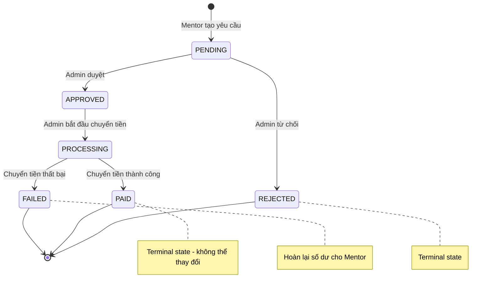

# Tài liệu Triển khai P2 — Nâng cấp sau MVP

> **Trạng thái**: ✅ Hoàn thành  
> **Ngày cập nhật**: 2026-05-25  
> **Mục tiêu**: Bổ sung 3 phân hệ nâng cao cho marketplace: đánh giá/phản hồi, trung tâm thông báo, và quản lý tài chính mentor.

---

## Tổng quan

| # | Hạng mục | Trạng thái | Độ phức tạp | Mô tả |
|---|----------|:----------:|:-----------:|--------|
| 9 | Notification Center | ✅ | Trung bình | Thông báo + quản lý device token (FCM) |
| 10 | Review & Rating | ✅ | Trung bình | Đánh giá sau booking + tóm tắt điểm |
| 11 | Mentor Finance & Payouts | ✅ | Cao | Quản lý doanh thu + rút tiền mentor |

---

## 1. Hạng mục #10 — Đánh giá & Phản hồi (Review & Rating)

### Mô tả
Cho phép Mentee đánh giá Mentor sau khi booking hoàn thành. Hỗ trợ xem danh sách đánh giá và tóm tắt điểm công khai.

### Danh sách API

| Method | Path | Auth | Mô tả |
|--------|------|:----:|--------|
| `POST` | `/api/v1/bookings/{bookingId}/reviews` | 🔒 JWT (Buyer) | Gửi đánh giá booking |
| `GET` | `/api/v1/mentors/{mentorId}/reviews?page=0&size=10` | 🌐 Public | Danh sách đánh giá của mentor (phân trang, DESC) |
| `GET` | `/api/v1/mentors/{mentorId}/rating-summary` | 🌐 Public | Tóm tắt điểm đánh giá |

### Request — Gửi đánh giá (`POST`)

```json
{
  "rating": 5,
  "comment": "Mentor hướng dẫn rất nhiệt tình và dễ hiểu!"
}
```

### Response — Gửi đánh giá

```json
{
  "code": 200,
  "message": "Gửi đánh giá thành công",
  "data": {
    "id": "3fa85f64-5717-4562-b3fc-2c963f66afa6",
    "bookingId": "a1b2c3d4-e5f6-7a8b-9c0d-1e2f3a4b5c6d",
    "mentorId": "f1e2d3c4-b5a6-9788-7766-554433221100",
    "packageId": "b5a6f1e2-9788-7766-5544-332211000000",
    "reviewerId": "77665544-3322-1100-f1e2-d3c4b5a69788",
    "reviewerName": "Nguyễn Văn A",
    "rating": 5,
    "comment": "Mentor hướng dẫn rất nhiệt tình và dễ hiểu!",
    "createdAt": "2026-05-23T09:44:00Z"
  }
}
```

### Response — Tóm tắt điểm đánh giá (`GET /rating-summary`)

```json
{
  "code": 200,
  "data": {
    "ratingAvg": 4.8,
    "ratingCount": 15,
    "distribution": {
      "1": 0,
      "2": 0,
      "3": 1,
      "4": 1,
      "5": 13
    }
  }
}
```

### Quy tắc nghiệp vụ

| Quy tắc | Chi tiết | Mã lỗi |
|----------|---------|--------|
| Quyền | Chỉ Buyer (chủ booking) mới được đánh giá | `REVIEW_ACCESS_DENIED` (403) |
| Trạng thái booking | Booking phải ở trạng thái `COMPLETED` | `BOOKING_NOT_COMPLETED` (400) |
| Không trùng lặp | Mỗi booking chỉ được đánh giá 1 lần | `REVIEW_ALREADY_EXISTS` (409) |
| Bất biến | Học viên không thể tự sửa/xóa đánh giá (immutable từ client) | — |

### Thiết kế kỹ thuật đáng chú ý

| Kỹ thuật | Mô tả |
|----------|--------|
| **Atomic SQL Update** | Cập nhật `rating_total`, `rating_count`, `rating_avg` trực tiếp trong DB bằng SQL nguyên tử, tránh Race Condition (Lost Update) |
| **Batch Fetching** | Gom ID reviewer và truy vấn thông tin theo lô từ `user_profiles`, tránh N+1 |
| **Immutability** | Cột `edited_at`, `deleted_at` dự phòng cho Admin moderation |

### Kiểm thử
- **ReviewServiceImplTest**: Chặn duplicate review, validate booking status, tính toán rating distribution.

---

## 2. Hạng mục #9 — Trung tâm Thông báo (Notification Center)

### Mô tả
Quản lý thông báo in-app và push notification qua Firebase Cloud Messaging (FCM). Hỗ trợ deep linking trên mobile.

### Danh sách API — Thông báo

| Method | Path | Auth | Mô tả |
|--------|------|:----:|--------|
| `GET` | `/api/v1/notifications?page=0&size=20` | 🔒 JWT | Danh sách thông báo (phân trang) |
| `GET` | `/api/v1/notifications/unread-count` | 🔒 JWT | Số lượng thông báo chưa đọc |
| `PATCH` | `/api/v1/notifications/{id}/read` | 🔒 JWT | Đánh dấu đọc 1 thông báo |
| `POST` | `/api/v1/notifications/read-all` | 🔒 JWT | Đánh dấu đọc tất cả (idempotent) |

### Danh sách API — Device Token

| Method | Path | Auth | Mô tả |
|--------|------|:----:|--------|
| `POST` | `/api/v1/devices/register` | 🔒 JWT | Đăng ký push token |
| `POST` | `/api/v1/devices/unregister` | 🔒 JWT | Hủy đăng ký push token |

### Request — Đăng ký token (`POST /register`)

```json
{
  "token": "fcm_token_string_here...",
  "platform": "ANDROID"
}
```

> Giá trị `platform` hợp lệ: `IOS`, `ANDROID`, `WEB`.

### Request — Hủy đăng ký token (`POST /unregister`)

```json
{
  "token": "fcm_token_string_here..."
}
```

### Response — Số thông báo chưa đọc

```json
{
  "code": 200,
  "data": {
    "unreadCount": 5
  }
}
```

### Events tạo thông báo tự động

| Event | Thông báo cho |
|-------|--------------|
| Order paid / Payment failed | Buyer + Mentor |
| Booking created / canceled / completed | Buyer + Mentor |
| Mentor approved / rejected | Mentor |
| New message | Người nhận |
| Report / Dispute status changed | Người tạo |
| Progress report submitted / reviewed | Mentee / Mentor |

### Thiết kế kỹ thuật đáng chú ý

| Kỹ thuật | Mô tả |
|----------|--------|
| **Transactional Event Listener** | Dùng `@TransactionalEventListener(phase = AFTER_COMMIT)` — persist thông báo đồng bộ, gửi FCM bất đồng bộ sau commit |
| **Async Push** | `@Async` cho FCM push — lỗi FCM không rollback business logic |
| **JSONB Metadata** | Trường `metadata` dạng `JSONB` (PostgreSQL) hỗ trợ deep linking mobile |

---

## 3. Hạng mục #11 — Quản lý Tài chính & Rút tiền Mentor (Mentor Finance)

### Mô tả
Cho phép Mentor xem doanh thu, yêu cầu rút tiền. Admin duyệt/từ chối/chuyển tiền. Hỗ trợ mã hóa thông tin ngân hàng và pessimistic locking chống double-spending.

### Danh sách API — Mentor

| Method | Path | Auth | Mô tả |
|--------|------|:----:|--------|
| `GET` | `/api/v1/mentors/me/revenue-summary` | 🔒 MENTOR | Xem tóm tắt doanh thu và số dư khả dụng |
| `POST` | `/api/v1/mentors/me/payouts` | 🔒 MENTOR | Yêu cầu rút tiền mới (tối thiểu 50,000 VND) |
| `GET` | `/api/v1/mentors/me/payouts?page=0&size=10` | 🔒 MENTOR | Lịch sử yêu cầu rút tiền (phân trang) |

### Danh sách API — Admin

| Method | Path | Auth | Mô tả |
|--------|------|:----:|--------|
| `GET` | `/api/v1/admin/payouts?status=PENDING&page=0&size=20` | 🔒 ADMIN | Danh sách yêu cầu rút tiền (lọc theo trạng thái) |
| `POST` | `/api/v1/admin/payouts/{id}/approve` | 🔒 ADMIN | Duyệt chấp thuận |
| `POST` | `/api/v1/admin/payouts/{id}/reject` | 🔒 ADMIN | Từ chối |
| `POST` | `/api/v1/admin/payouts/{id}/pay` | 🔒 ADMIN | Đánh dấu đã chuyển tiền |
| `POST` | `/api/v1/admin/payouts/{id}/fail` | 🔒 ADMIN | Đánh dấu chuyển tiền thất bại |

### Response — Tóm tắt doanh thu

```json
{
  "code": 200,
  "data": {
    "totalEarned": 10000000.00,
    "totalWithdrawn": 4000000.00,
    "lockedBalance": 1000000.00,
    "availableBalance": 5000000.00
  }
}
```

> **Công thức**: `availableBalance = totalEarned - totalWithdrawn - lockedBalance`

### Request — Yêu cầu rút tiền (`POST /payouts`)

```json
{
  "amount": 1000000.00,
  "bankName": "Vietcombank",
  "accountNumber": "1902830192830",
  "accountHolder": "NGUYEN VAN A"
}
```

### Response — Yêu cầu rút tiền

```json
{
  "code": 200,
  "message": "Gửi yêu cầu rút tiền thành công",
  "data": {
    "id": "e2f3a4b5-c6d7-48e9-b0f1-2a3b4c5d6e7f",
    "mentorId": "77665544-3322-1100-f1e2-d3c4b5a69788",
    "grossAmount": 1000000.00,
    "platformFeeRate": 10.00,
    "netAmount": 900000.00,
    "status": "PENDING",
    "bankName": "Vietcombank",
    "accountNumber": "*******9283",
    "accountHolder": "NGUYEN VAN A",
    "createdAt": "2026-05-23T16:45:00Z"
  }
}
```

### Request — Từ chối (`POST /reject`)

```json
{
  "rejectReason": "Tên chủ tài khoản không trùng khớp với hồ sơ đăng ký."
}
```

### Request — Đánh dấu đã chuyển tiền (`POST /pay`)

```json
{
  "transactionReference": "FT26143928139210"
}
```

### Request — Đánh dấu thất bại (`POST /fail`)

```json
{
  "failureReason": "Tài khoản ngân hàng của người nhận đã bị khóa hoặc sai thông tin."
}
```

### Máy trạng thái rút tiền



### Quy tắc nghiệp vụ

| Quy tắc | Chi tiết |
|----------|---------|
| Số tiền tối thiểu | 50,000 VND |
| Phí nền tảng | Tính trước khi tính net amount (`grossAmount * (1 - feeRate/100)`) |
| Số dư khả dụng | `totalEarned - totalWithdrawn - lockedBalance` |
| Terminal states | `PAID`, `FAILED`, `REJECTED` — không thể thay đổi |
| Data Masking (Mentor) | Số tài khoản hiển thị dạng `*******1234` |
| Data Masking (Admin) | Admin thấy **đầy đủ** thông tin để chuyển tiền |

### Mã lỗi Nghiệp vụ (Finance / Payouts)

| Quy tắc | Chi tiết | Mã lỗi |
|----------|---------|--------|
| Không đủ số dư | Số tiền yêu cầu vượt quá số dư khả dụng | `INSUFFICIENT_BALANCE` (400) |
| Số tiền không hợp lệ | Số tiền rút nhỏ hơn 50,000 VND hoặc không hợp lệ | `INVALID_PAYOUT_AMOUNT` (400) |
| Không tìm thấy yêu cầu | Yêu cầu rút tiền không tồn tại | `PAYOUT_REQUEST_NOT_FOUND` (404) |
| Chuyển trạng thái không hợp lệ | Thay đổi trạng thái không tuân theo State Machine | `INVALID_PAYOUT_STATUS_TRANSITION` (400) |
| Từ chối truy cập | Mentor cố gắng truy cập yêu cầu rút tiền của người khác | `PAYOUT_ACCESS_DENIED` (403) |

### Thiết kế kỹ thuật đáng chú ý

| Kỹ thuật | Mô tả |
|----------|--------|
| **Pessimistic Locking** | `@Lock(PESSIMISTIC_WRITE)` trên `MentorProfile` khi tạo payout — ngăn double-spending/overdraft |
| **AES/GCM/NoPadding Encryption** | Số tài khoản ngân hàng mã hóa ở lớp ứng dụng qua `EncryptedStringConverter` (JPA `@Converter`) |
| **Data Masking** | API Mentor tự động che số tài khoản, chỉ Admin xem đầy đủ |
| **Audit Log** | Mỗi thay đổi trạng thái payout tạo 1 bản ghi `PayoutAuditLog` |

### Kiểm thử
- **PayoutServiceImplTest**: Cộng/trừ số dư, đóng băng giao dịch, ngăn rút quá hạn mức.

---

## Tổng hợp Files đã thay đổi

### Files mới tạo (~30+ files)

| Module | Files chính |
|--------|-------------|
| **Review** | `ReviewController`, `CreateReviewRequest`, `ReviewResponse`, `RatingSummaryResponse`, `BookingReview`, `BookingReviewRepository`, `ReviewService`, `ReviewServiceImpl` |
| **Notification** | `NotificationController`, `DeviceTokenController`, `NotificationResponse`, `UnreadCountResponse`, `RegisterDeviceRequest`, `UnregisterDeviceRequest`, `Notification`, `DeviceToken`, `NotificationErrorCode`, `NotificationEventListener`, `NotificationRepository`, `DeviceTokenRepository`, `NotificationService`, `NotificationServiceImpl` |
| **Finance** | `PayoutController`, `AdminPayoutController`, `CreatePayoutRequest`, `AdminReviewPayoutRequest`, `PayoutRequestResponse`, `RevenueSummaryResponse`, `PayoutRequest`, `PayoutAuditLog`, `FinanceErrorCode`, `PayoutRequestRepository`, `PayoutAuditLogRepository`, `PayoutService`, `PayoutServiceImpl` |
| **Infrastructure** | `EncryptedStringConverter` (AES/GCM cho sensitive data) |

### Files đã sửa

| File | Module | Thay đổi |
|------|--------|----------|
| `SecurityConfig.java` | Config | Mở public cho review/rating endpoints |
| `MentorProfile.java` | Mentor | +`ratingCount`, +`ratingTotal`, +`@Version`, `Float→Double` cho `ratingAvg` |
| `MentorResponse.java` | Mentor | `Float→Double` cho `ratingAvg` |
| `MentorProfileRepository.java` | Mentor | +`updateRatingIncrementally()`, +`findAndLockByUserId()` |
| `BookingErrorCode.java` | Booking | +3 error codes (review) |
| `BookingRepository.java` | Booking | +`calculateTotalEarnedByMentor()` query |

### Database Migrations

| Migration | Mô tả |
|-----------|--------|
| `V202605230003__create_notifications_and_devices.sql` | Tạo bảng `notifications` (JSONB metadata) + `device_tokens` |
| `V202605230004__create_reviews.sql` | Tạo bảng `booking_reviews` + thêm `rating_count`, `rating_total` vào `mentor_profiles` |
| `V202605230005__create_mentor_finance.sql` | Tạo bảng `payout_requests` + `payout_audit_logs` |

---

## ⚠️ Breaking Changes

> [!WARNING]
> `MentorResponse.ratingAvg` type changed from `Float` to `Double`. Frontend/Mobile clients consuming this field should update their type definitions accordingly.
